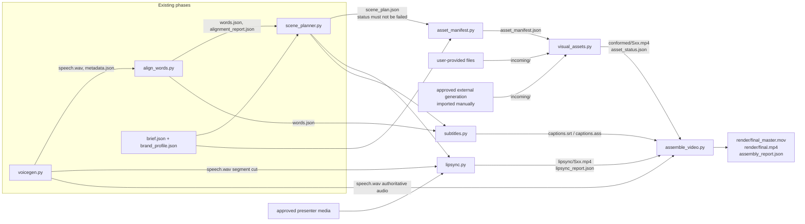

# Phase 4 — Visual Generation & Synchronization: Design

Status: **design only (Phase 4A)**. Nothing in this document has been implemented, installed, downloaded or generated.
Date: 2026-10-01 · Project: `~/Desktop/indicf5-voice-test` · Reference job: `outputs/job_20261001_103028_eb8ca2` (6.760 s, 2 scenes)

**Rule that governs everything below:** `speech.wav` from Phase 1 is the only narration audio. No later stage may re-time, re-generate, stretch, denoise or replace it. Picture is fitted to the audio, never the other way round.

---

## 1. Current architecture audit

### 1.1 What exists

| Phase | Module | Output in each job folder | What Phase 4 reuses |
|---|---|---|---|
| 1 | `scripts/voicegen.py` | `speech.wav` (24 kHz, mono, PCM16), `input.txt`, `metadata.json`, `generation.log` | The authoritative audio; `metadata.output.duration_s`; `metadata.chunks[]` (exact sentence placements) |
| 2 | `scripts/align_words.py` | `alignment/words.json`, `words.csv`, `subtitles.srt`, `alignment_report.json` | Word timings and `status` (`aligned`/`uncertain`/`unaligned`); `build_cues()`, `srt_time()`, `check_srt()` for subtitles |
| 3 / 3.1 | `scripts/scene_planner.py` | `scene_plan/scene_plan.json`, `scene_plan.md` | Scenes with timeline `start_s`/`end_s` (contiguous over the whole audio), `narration_*`, `visual_mode`, `asset_requirements`, `brand_constraints`, `transition`, `boundary_after`, `validation.status` |
| shared | `scripts/common.py` | — | Paths, `inference_lock`, `memory_snapshot`, `PeakMemorySampler` |
| shared | `scripts/validate_audio.py` | — | `audio_stats()` for WAV checks |

Conventions to keep:
- One folder per job (`outputs/job_<id>/`), with one subfolder per stage.
- A machine-readable `*_report.json` from every stage.
- An `--overwrite` guard on every write.
- Error codes like `ASSET_MISSING`.
- Exit codes: 0 ok, 2 needs review, 1 failed.
- Offline by default (`HF_HUB_OFFLINE=1`).

### 1.2 What does not exist (audit findings)

| Capability | Status on this Mac | Consequence |
|---|---|---|
| FFmpeg / ffprobe | **Not installed** | Needed for every video stage. Installing it needs your approval (§12) |
| Video libraries (OpenCV, PyAV, imageio, moviepy) | Not installed | Not required if FFmpeg is called as a subprocess, which is the recommended design |
| Image library | Pillow 12.3 and matplotlib are installed | Placeholder frames, brand-card drafts and subtitle previews can be made offline now |
| macOS media tools | `swift` (AVFoundation), `avconvert`, `sips`, `afconvert` | AVFoundation could compose and encode H.264 + AAC without installing anything. It's a fallback only, because the code would be much larger than an FFmpeg filtergraph |
| Face, lip-sync or video models | None cached (only IndicF5, Vocos, whisper-base.en) | Any local lip-sync means a download plus approval |
| `assets/`, `docs/` directories | Absent (this document creates `docs/`) | Assets will live per job (§4) |
| Presenter source | `~/Downloads/linkedin-video.mp4`: 1138×640, H.264, about 323 kbps, 52.6 s | It's usable for a proof of concept at 720p but is soft for 1080p. Using your likeness needs explicit consent in the brief (`presenter.consent_confirmed`) |
| Brand assets | `texts/briefs/prudential_brand_profile.json` has only the brand name | Logo, colours, typography, tone, restrictions, disclaimers and prohibited elements are all `REQUIRES_USER_INPUT`. **They are not invented here** |

### 1.3 Gaps in upstream outputs that Phase 4 must check

- **The saved original plan predates Phase 3.1.** `outputs/job_…/scene_plan/scene_plan.json` was written by Phase 3.0, so it has no `boundary_after` and no `validation.status`. Phase 4 will **refuse plans without `validation.status`** and ask for a re-plan with `--overwrite`, which needs your approval because it replaces that file.
- **Phase 2 timing is coarse and unverified.** Resolution is 20 ms (10 ms at word edges), and accuracy hasn't been measured. Video frames (40 ms at 25 fps) are coarser still, so all timing claims below are "±1 frame", never frame-exact.

---

## 2. Proposed end-to-end architecture

```
 Phase 1          Phase 2              Phase 3/3.1            Phase 4 (this design)
 voicegen   ──►   align_words   ──►    scene_planner   ──►   A asset_manifest ──► B visual_assets ─┐
 speech.wav       words.json           scene_plan.json        (what is needed)    (intake/conform/ │
 metadata.json    alignment_report     (validated)                                 placeholders)   │
     │                 │                                                                           ▼
     │                 └──────────────────────────────►  D subtitles  ──────────►  E assemble_video
     │                                                    (SRT + ASS)                (FFmpeg)
     └──────────► C lipsync (talking_head scenes only) ──────────────────────────►      │
                  cuts exact WAV segments; validates returned clips                      ▼
                                                                         render/final_master.mov
                                                                         render/final.mp4 + report
```

Design principles:
1. **Specify, then source, then assemble.** Every scene gets a written asset spec first. Sources (user file, approved generation, placeholder) are recorded explicitly, and nothing is substituted without being recorded.
2. **One authoritative timeline.** It comes from `scene_plan.json`, whose times are derived from `words.json`. Clips are trimmed to it. Audio is never edited to fit clips.
3. **Offline by default.** Any stage that would touch a cloud service needs an explicit `--provider <name>` plus an approval record. The default provider is `manual`, meaning you drop a file into a folder.
4. **Draft vs final.** A render that contains any placeholder, or any `talking_head` scene without a validated lip-sync, can only be produced as `draft`. Watermarking makes that visible.

---

## 3. Data flow diagram



---

## 4. Module responsibilities (proposed, not created)

All modules live in `scripts/`, follow the existing CLI style (`--job <JOB_ID>`, `--overwrite`, `*_report.json`, exit codes 0/2/1), and never modify earlier phases' files.

Per-job layout added by Phase 4:
```
outputs/job_<id>/
├── assets/
│   ├── asset_manifest.json   asset_manifest.md
│   ├── incoming/             # files you drop in (or imported generations), named by scene: S01.*, S02.*
│   ├── placeholders/         # DRAFT-watermarked stand-ins, never used in a final render
│   ├── conformed/            # normalised clips: exact size, fps, duration; no audio
│   └── asset_status.json
├── lipsync/   Sxx_audio.wav  Sxx_input.*  Sxx_lipsync.mp4  lipsync_report.json
├── subtitles/ captions.srt  captions_highlight.ass  subtitle_report.json
└── render/    final_master.mov  final.mp4  assembly_report.json  preview_frames/
```

| Module | Responsibility | Inputs | Outputs | Dependencies | Validation |
|---|---|---|---|---|---|
| `media_utils.py` (shared helper) | ffprobe wrappers, frame/time maths, exact WAV segment cutting, decoded-audio comparison | media paths | Python dicts | FFmpeg binaries (approval); numpy, soundfile (installed) | Fails cleanly with `FFMPEG_MISSING` if FFmpeg is absent |
| `asset_manifest.py` (Stage A) | Turns each scene into an asset spec: type, description, aspect, duration plus handles, brand requirements, person needed, lip-sync needed, source | `scene_plan.json`, brief, brand profile | `assets/asset_manifest.json` + `.md` | Standard library only. **Runs offline now** | Plan `validation.status` ≠ failed; every scene gets exactly one primary asset; brand fields copied verbatim or `REQUIRES_USER_INPUT` |
| `visual_assets.py` (Stage B) | Subcommands `intake` (register a file for a scene), `conform` (scale/crop/pad, fps, trim, strip audio), `placeholder` (DRAFT stand-in), `check` | manifest, `incoming/` | `conformed/Sxx.mp4`, `placeholders/`, `asset_status.json` | FFmpeg for video; Pillow for stills | Source probed; aspect handled explicitly; duration ≥ required; no audio stream after conform; placeholders flagged |
| `lipsync.py` (Stage C) | Cuts each talking-head scene's exact audio segment from `speech.wav`; runs or imports lip-sync through a provider adapter (`manual` first); validates the result | plan, manifest, presenter media, `speech.wav` | `lipsync/Sxx_*`, `lipsync_report.json` | FFmpeg; a provider (local model or hosted service, each needing approval) | Duration ±1 frame; returned audio (if any) has offset 0 against the segment; frame count; human review required |
| `subtitles.py` (Stage D) | SRT plus ASS word-highlight subtitles from `words.json` | `words.json`, plan, style config | `subtitles/*` | Standard library; reuses `align_words.build_cues/srt_time/check_srt`. **Runs offline now** | Cue times equal word times (no estimation); in order; within duration; uncertain words not highlighted |
| `assemble_video.py` (Stage E) | Builds and runs the FFmpeg graph: order, trim, transitions, burned-in or soft subtitles, mux of the authoritative WAV | plan, conformed clips, lip-sync clips, subtitles, `speech.wav` | `render/*`, `assembly_report.json` | FFmpeg (with libass to burn subtitles) | §8.5 checks; refuses `final` mode while any placeholder or unvalidated lip-sync remains |
| `campaign.py` (later) | Expands one campaign brief into N variant jobs (script, aspect ratio, length), running Phases 1–4 per variant | campaign brief | `outputs/campaign_<id>/variants.json` + one job per variant | Existing modules | One validated job per variant; shared brand assets referenced, not copied |

That's six new modules: five for the pipeline plus `media_utils.py`. Provider adapters for generation and lip-sync are small classes inside `visual_assets.py` and `lipsync.py`, starting with only `manual`, rather than a separate framework.

### 4.1 Asset manifest entry (Stage A schema sketch)

```json
{
  "scene_id": "S01",
  "timeline": {"start_s": 0.0, "end_s": 3.99, "duration_s": 3.99,
               "required_clip_s": 4.165, "handles_s": {"head": 0.0, "tail": 0.175}},
  "visual_mode": "talking_head",
  "asset_type": "presenter_video",
  "description": "<copied from scene_plan.visual_description>",
  "aspect_ratio": "16:9", "target_resolution": [1920, 1080], "fps": 25,
  "person_required": true, "lipsync_required": true,
  "brand_requirements": {"colors": "REQUIRES_USER_INPUT", "...": "copied verbatim from the plan"},
  "source": {"kind": "user_provided | approved_generation | existing | placeholder | unresolved",
             "provider": "manual", "path": null, "approval_ref": null},
  "acceptance": {"min_duration_s": 4.165, "no_audio": true, "no_text_or_logos": true,
                 "consent_required": true},
  "status": "unresolved"
}
```

`required_clip_s` includes the transition handles (§8.3), so clips are always requested a little longer than the scene.

---

## 5. Local vs cloud comparison (Stage B: visual generation)

| Approach | Where it runs | Automation | Sync with our WAV | Cost / approval | Fit |
|---|---|---|---|---|---|
| **Static image + motion** (Pillow or user image, then FFmpeg `zoompan`/`crop` Ken Burns) | Local | Fully scriptable | Exact: the clip is rendered at precisely the scene duration | Free; FFmpeg install only | **Best first step.** Deterministic, offline, ideal for brand cards and the proof of concept |
| **Brand/text graphics** (Pillow-rendered card or user-supplied design, optionally animated in FFmpeg) | Local | Fully scriptable | Exact | Free | Needs the real logo, colours and fonts, which are `REQUIRES_USER_INPUT` |
| **User-provided / stock footage** | Local intake | Scriptable intake and conform | Trimmed to the scene; must be at least as long as the scene | Stock licences are your responsibility | Reliable; quality depends on the source |
| **Google Flow** (Google's AI filmmaking web app, built on Veo/Imagen) | Google cloud, **browser UI** | No supported automation API for the Flow UI as far as I know; browser automation would be brittle and may conflict with its terms. **Not recommended** | Not synchronized: clips have their own fixed lengths and (with newer Veo versions) their own audio, which must be **stripped** and the clip **trimmed** | Google account; subscription or AI credits. **Approval required** | Use manually: you generate, download and drop into `incoming/S0x.mp4`, and Stage B conforms it |
| **Google Vids** (Workspace video editor) | Google cloud, browser | Manual editor, not a pipeline component | n/a | Workspace licence. **Approval required** | A manual alternative to this whole pipeline, not a stage in it |
| **Veo through an official API** (Gemini API or Vertex AI) | Google cloud | Scriptable via SDK; needs an API key and billing | Same as Flow: trim, strip audio, no lip-sync | Billed per generated second (check current pricing). **Approval required** before any call | The programmatic route, if you later approve cloud generation. Implement as a provider adapter behind `--provider veo_api --approved` |
| **Local text-to-video models** (open diffusion video models) | Local | Scriptable | Trimmed | Multi-GB downloads; most target CUDA GPUs with more memory than this 16 GB M4. **Approval required** | Not recommended on this hardware |

What this means in practice:
- **Any AI-generated clip is just picture.** Its length is chosen by the generator (typically a few seconds per generation), and its audio is discarded.
- **We never assume a generated clip lines up with the narration.** It's trimmed to the scene window, and if it's too short the render fails (§9). It is never stretched silently.
- **No generated clip counts as `talking_head`.** Generated "speaking" people move their mouths to the generator's own audio, not ours, so that's only possible after a real lip-sync pass (§6).

---

## 6. Lip-sync strategy (Stage C)

### 6.1 What counts as lip-sync

- **Genuine lip-sync:** mouth motion is computed **from our audio segment**, either by editing the mouth region of an existing presenter video (video-to-video "dubbing") or by animating a still portrait from the audio.
- **Not lip-sync:** text-to-video generation of a person talking, or any clip whose mouth movement came from other audio. Those may only be used as base footage, with the mouth replaced by a real lip-sync pass, or as non-speaking B-roll.

### 6.2 Pipeline for a `talking_head` scene

1. **Consent gate.** `brief.presenter.consent_confirmed` must be `true`. It is currently `null`, so this step blocks.
2. **Presenter input.** You approve either a presenter clip at least as long as the scene (neutral face, mouth visible, little head turning, good light) or a still portrait. The only candidate on disk is `linkedin-video.mp4` at 1138×640, which is usable at 720p for a proof of concept.
3. **Audio segment.** Cut the exact samples `[start_s × 24000, end_s × 24000)` from `speech.wav` and write them as PCM. This is the input to lip-sync **only**; the final mux still uses the full `speech.wav`.
4. **Lip-sync provider.** Run it (local or hosted, each needing approval) and write `lipsync/S01_lipsync.mp4` at 25 fps.
5. **Validation:**
   - the output duration matches the segment to within 1 frame
   - if the provider returned audio, its offset against the segment is 0 ± 1 ms and its correlation is at least 0.99; that audio is then **discarded**
   - frame count = round(duration × fps)
   - the face is present in every frame (optional: needs a detector, which means approval)
   - a mandatory human review, recorded as `lipsync_report.reviewed_by`
6. **Identity and consistency.** Use one presenter source per video and the same crop and colour treatment across talking-head scenes. Apply no face restoration or style transfer unless you approve it, since those can change identity.

### 6.3 Options (none installed; nothing downloaded)

Verify licences, terms and current versions before use. Hardware notes are expectations, not measurements.

| Option | Type | Where | Dependencies / hardware | Licence and privacy notes |
|---|---|---|---|---|
| **Wav2Lip** (+ optional GFPGAN face restoration) | Edits the mouth of an existing video | Local, PyTorch; CPU possible, MPS untested | Small model (hundreds of MB) + face detector; low-resolution mouth (96 px) looks soft at 1080p | Pretrained weights are, to my knowledge, **research/non-commercial**: not suitable for a commercial ad without a licence. Stays on device |
| **MuseTalk** | Edits the mouth of an existing video (256 px face region) | Local, PyTorch | Several model components (VAE, audio encoder, pose); built for CUDA; MPS untested on 16 GB | Check code and weights licences. Stays on device |
| **LatentSync** | Diffusion lip-sync, video to video | Local, PyTorch | Diffusion-based; expected to need a large CUDA GPU, **likely impractical** on a 16 GB M4 | Check licence. Stays on device |
| **Still-portrait animators** (e.g. SadTalker, EchoMimic, Hallo) | Animate a still image from audio | Local | Heavy, CUDA-oriented | Identity drift is common. Check licences. Stays on device |
| **Hosted lip-sync APIs** (e.g. Sync Labs/sync.so, HeyGen, D-ID, Hedra) | Video to video or photo to video | Cloud | No local hardware | **Your face and voice are uploaded** (biometric data). Needs consent, a review of the data-retention terms, and per-minute billing. **Approval required** |

**Recommendation:**
1. Don't block the first proof of concept on lip-sync; it uses a placeholder for S01.
2. Then run one **gated lip-sync evaluation** on the 3.99 s S01 segment. Either a hosted trial, with your approval and a review of the data handling, or a local MuseTalk/Wav2Lip feasibility test on MPS, with your approval of the download and licence.
3. Score both against the §6.2 checks plus a human side-by-side review.

---

## 7. Subtitle strategy (Stage D)

- **Timing comes only from `words.json`.** No LLM or estimated times. Cue start = first word `start_s`; cue end = last word `end_s`, held up to +0.3 s but never past the next cue's start or the audio end.
- **Cues:** reuse Phase 2's `build_cues` rules (one sentence per cue; at most 42 characters per line, 2 lines, 7 s), and reuse `check_srt` to validate.
- **Word highlighting (ASS):** one event per word, covering that word's start up to the next word's start. Each event shows the whole cue with the current word coloured. The highlight colour is a brand colour if one is supplied, otherwise a neutral style marked `REQUIRES_USER_INPUT`. Rendering uses libass inside FFmpeg.
- **Punctuation** stays attached to its word (Phase 2 keeps `Hello,` and `India!` intact). It's displayed but never gets its own timing.
- **Uncertain or unaligned words:**
  - A cue containing an `uncertain` word is shown as a whole at sentence level, with **no per-word highlight** for that cue. It's listed in `subtitle_report.json` and makes the stage status `needs_review`.
  - An `unaligned` word (null times) is shown in its cue, with the cue's times taken from aligned neighbours. If the cue has no aligned word at all, the stage fails.
- **Placement:**
  - 16:9 at 1920×1080: bottom-centre, bottom margin about 8% (86 px), side margins about 10% (192 px), inside the title-safe area.
  - 9:16 variants: margins of about 15% at the bottom to clear platform UI.
  - Font: brand typography if supplied, otherwise a system font such as Helvetica Neue, flagged as a placeholder.
- **Brand-card scenes (`text_graphic`):** by default, subtitles are **suppressed** while on-screen brand text is visible, configurable per brief. The decision is recorded in the report, and it doesn't change the narration.
- **Outputs:**
  - `captions.srt` for platforms and soft subtitles
  - `captions_highlight.ass` for burning in
  - `subtitle_report.json`: cue times, suppressed cues, uncertain words, and the SRT and ASS validation results

---

## 8. FFmpeg assembly strategy (Stage E)

### 8.1 Output formats

| File | Video | Audio | Purpose |
|---|---|---|---|
| `final_master.mov` | H.264 High, yuv420p, 1920×1080 (16:9) or 1080×1920 (9:16), 25 fps CFR | **PCM s16, 24 kHz, mono: the samples of `speech.wav`, bit for bit** | Archival master; proves the narration is untouched |
| `final.mp4` | Same video, with `+faststart` | AAC-LC 48 kHz (resampled from 24 kHz) | Delivery and upload |

The 25 fps rate is a proposal: it matches common lip-sync models, and its 40 ms frames are coarser than Phase 2's timing resolution. It's configurable per brief.

### 8.2 Scene ordering, timing and trimming

- **Order** is `scene_plan.scenes` as written, and its `start_s`/`end_s` cover `[0, duration]` with no gaps.
- **Every cut point is quantised to the nearest frame.** The planner places cuts mid-pause, so a 1-frame (≤ 20 ms) shift stays inside the silence. Exception: a boundary with `boundary_after.safe = false` has no silence, so it is cut exactly at the frame nearest the word edge and flagged in the report.
- **Trimming:** each conformed clip is trimmed with `trim`/`setpts` to `[clip_in, clip_in + required_clip_s)`. `clip_in` defaults to 0 or is set in the manifest.
- **A clip shorter than required is a failure** (`CLIP_TOO_SHORT`). There's no automatic loop, slow-down or freeze. A freeze-frame extension exists only behind an explicit `--allow-freeze-tail <seconds>` flag, recorded in the report.

### 8.3 Transitions

The plan's transition text is turned into parameters:
- **Hard cut:** clips are concatenated.
- **Cross-dissolve of length d at boundary b:** `xfade=transition=fade:duration=d:offset=b−d/2` in timeline time. To keep the **total length equal to the audio**, clip i must extend d/2 past b and clip i+1 must start d/2 before b. These are the `handles_s` from the Stage A manifest.
- **The plan already keeps d inside the pause.** For the reference job, d = 0.35 s is centred at 3.99 s, giving 3.815–4.165 s inside the 3.64–4.34 s silence.
- **Fade in from black** on the first scene. **Fade out to black** starting no earlier than the last narration word ends: 6.45 s in the reference job, inside the tail before 6.76 s.

### 8.4 Aspect ratio

- **Conform happens in Stage B, never in assembly.** Each clip is scaled to cover the target, then centre-cropped (or cropped at a manifest-defined anchor). Letterboxing (pad) is used only if the brief says so.
- **A wrong source aspect is never stretched.** Crop versus pad is decided explicitly in the manifest, and any crop that would cut a detected face or brand area (where a detector or manual box is available) makes the scene need review.

### 8.5 Audio insertion and sync validation

- **Audio input:** `speech.wav` is mapped directly (`-map <wav>:a`). The video stream is cut to exactly the audio duration. No `-shortest` (which can truncate silently), no audio filters and no loudness processing.
- **Checks after rendering:**
  1. **Duration (video):** video duration = audio duration ± 1 frame. Audio sample count = 162,239 for the reference job, exactly.
  2. **Bit-exact audio in the master:** decoding `final_master.mov` audio gives PCM identical to `speech.wav` (same SHA-256 of the samples).
  3. **Delivery sync:** decode `final.mp4` audio, resample, and cross-correlate against `speech.wav`. The offset must be 0 ± 1 ms; this catches AAC priming errors. Correlation must be at least 0.99.
  4. **Format:** stream layout, resolution, fps (CFR), pixel format and codec all as specified.
  5. **Cut and subtitle timing:** extract preview frames at every cut ±1 frame and at each subtitle cue's start and end, then show them in `preview_frames/` for human review.
  6. **Mode:** `assembly_report.mode` is `draft` if any placeholder or unvalidated lip-sync was used. `final` is refused unless every scene's asset is real and validated.

---

## 9. Risks and failure handling

The rule throughout: **never silently substitute a visual, and never modify the narration.** Every fallback is explicit, recorded, and makes the run either `draft` or `failed`.

| Failure | Detected by | Behaviour |
|---|---|---|
| Invalid scene plan (`validation.status = failed`, or missing it, as with plans older than Phase 3.1) | All Phase 4 stages at load | Stop with `PLAN_INVALID`/`PLAN_OUTDATED`; tell you to re-run the planner |
| Uncertain word timestamps | Plan `needs_review`; `words.json` status | Allowed only in draft. Subtitles drop word highlighting for that cue; the report lists the words. `final` needs `--accept-review <scene ids>` |
| Missing visual asset | Stage B `check` | Scene `unresolved` → `ASSET_MISSING`. A placeholder only with `placeholder` explicitly run, in draft mode |
| Missing brand assets (logo, colours, fonts) | Manifest (`REQUIRES_USER_INPUT`) | Brand card rendered as a labelled placeholder in draft only. The run never makes up a logo or colours |
| Generation failure (external tool) | You, or a provider adapter's error | Recorded in `asset_status.json` with the provider's message (secrets redacted). **No automatic retry and no automatic fallback** to another generator |
| Wrong aspect ratio | ffprobe during intake | Explicit crop or pad per manifest. If unspecified → `ASPECT_DECISION_REQUIRED` |
| Clip shorter than scene plus handles | Intake or conform | `CLIP_TOO_SHORT`, listing the shortfall in seconds. A freeze tail only with an explicit flag |
| Wrong fps / variable frame rate | ffprobe | Conform to CFR 25 fps; report whether frames were duplicated or dropped |
| Lip-sync failure (no face, bad duration, offset ≠ 0, reviewer rejects) | Stage C checks | `LIPSYNC_FAILED`. The scene stays draft (placeholder or presenter clip without lip-sync, clearly labelled). The narration is not changed and not cut |
| Audio/video duration mismatch | Stage E check 1 | `AV_DURATION_MISMATCH`: the render is marked failed and not delivered. Audio is never re-timed |
| AAC sync offset | Stage E check 3 | `AV_SYNC_OFFSET`: deliver the master only; investigate the encoder settings |
| FFmpeg missing or missing libass | `media_utils` probe | `FFMPEG_MISSING` / `SUBTITLE_BURN_UNAVAILABLE` (soft-subtitle MP4 is still possible) |
| Credentials | All provider adapters | Keys read from the environment or keychain at call time only; never logged or written to reports. The same redaction as `voicegen.redact()` |

---

## 10. Recommended implementation sequence

Each step is small, testable on its own, and stops on failure.

| Step | Scope | Runs offline? | Needs approval? |
|---|---|---|---|
| **4B-0** | `asset_manifest.py` + `subtitles.py` (SRT + ASS) for the reference job; re-run the planner with `--overwrite` to refresh the Phase 3.0 plan to the 3.1 schema | ✅ fully | Only the plan refresh (it replaces the original plan file) |
| **4B-1** | Install FFmpeg; `media_utils.py`; `visual_assets.py placeholder/conform`; `assemble_video.py` in **draft** mode with placeholders → the first proof of concept (§11) | ✅ after install | **FFmpeg install** |
| **4B-2** | Real local assets: your logo and brand card, and a presenter still or clip (no lip-sync yet: S01 stays draft) | ✅ | Brand assets from you; presenter consent |
| **4B-3** | Lip-sync evaluation on S01 (3.99 s): a hosted trial **or** a local model feasibility test, scored by §6.2 | Local option ✅ after download; hosted ❌ | **Download or hosted service, licence and data-handling review** |
| **4B-4** | Generated B-roll (Flow, Veo or stock) imported through `incoming/` and conformed | Intake ✅; generation ❌ | **Each paid generation** |
| **4B-5** | `campaign.py`: variants (script, length, 16:9/9:16) from one brief | ✅ apart from any generation | Per variant, if it uses paid steps |

---

## 11. First proof-of-concept acceptance criteria (job `job_20261001_103028_eb8ca2`)

**Scope:** steps 4B-0 and 4B-1 only. Two scenes: S01 is a labelled `talking_head` placeholder; S02 is a placeholder brand card with no logo, since none was supplied. No paid operations, and no network beyond the one approved FFmpeg install.

1. **Inputs untouched:** every Phase 1, 2 and 3 file in the job is hash-identical before and after, except the approved plan refresh in 4B-0.
2. **Manifest:** 2 entries. Source `placeholder` for both. S01 has `lipsync_required: true` and `consent_required: true`. All brand fields are copied verbatim or `REQUIRES_USER_INPUT`.
3. **Subtitles:**
   - `captions.srt` has 2 cues with times equal to `words.json`: 00:00:00,150–00:00:03,640 and 00:00:04,340–00:00:06,450. It passes `check_srt`.
   - The ASS file has one highlight event per aligned word (14).
   - The S02 cue is suppressed or kept per the brief, and recorded either way.
4. **Render, master:** `final_master.mov` is 1920×1080, 25 fps CFR, yuv420p H.264. The audio is PCM 24 kHz mono, sample-identical to `speech.wav` (162,239 samples, same SHA-256).
5. **Render, delivery:** in `final.mp4`, the decoded audio's offset against `speech.wav` is 0 ± 1 ms and its correlation is at least 0.99.
6. **Duration:** video = 6.760 s ± 1 frame (40 ms).
7. **Cut:** S01→S02 at frame 100 (4.000 s, the nearest frame to 3.990 s), inside the 3.64–4.34 s pause. The dissolve is 0.35 s, centred, within that pause. It starts with a fade-in from black, and the fade-out starts no earlier than 6.45 s.
8. **Labelling:** every placeholder frame is visibly watermarked "DRAFT – PLACEHOLDER Sxx". `assembly_report.mode = "draft"`, and asking for `final` returns an error naming S01 (no lip-sync) and S02 (no brand assets).
9. **Review frames:** `preview_frames/` has frames at 0.15, 3.64, 3.99/4.00 and 4.34 s, and at 6.45 s, so you can check cuts and subtitles visually.
10. **Error handling:** removing `conformed/S02.mp4` makes the render fail with `ASSET_MISSING`, with no substitution.

---

## 12. External services and operations that need your approval

None of these has been done. Each would be requested explicitly, one at a time.

| # | Operation | Why | Type | Privacy / cost notes |
|---|---|---|---|---|
| 1 | **Install FFmpeg** (Homebrew `ffmpeg`, a static macOS build, or the `imageio-ffmpeg` pip wheel inside `.venv`) | Needed by every video stage | Software install (free) | Confirm the chosen build includes **libass** for burned-in subtitles. Size depends on the method, from tens to a few hundred MB |
| 2 | **Refresh the original scene plan** (`scene_planner.py --overwrite`) | It predates the Phase 3.1 schema | Replaces a local output | Local only |
| 3 | **Presenter consent** (`presenter.consent_confirmed: true`) and choice of presenter media | Talking-head scenes use your likeness | Your decision | — |
| 4 | **Real brand assets**: logo, colours, typography, tone, restrictions, disclaimers, prohibited elements | Brand cards and final renders | Your input (from official Prudential guidelines, not invented) | — |
| 5 | **Local lip-sync model download** (e.g. MuseTalk or Wav2Lip weights, face detector) | Lip-sync evaluation | Model download (several hundred MB to several GB) | Check licences: some weights are **non-commercial only**. Stays on device |
| 6 | **Hosted lip-sync service trial** (e.g. Sync Labs/sync.so, HeyGen, D-ID, Hedra) | Lip-sync evaluation | **Paid cloud API / account** | **Uploads your face and voice.** Review data retention and terms first |
| 7 | **Google Flow** generation | B-roll | **Paid** (subscription or credits), browser, Google account | Prompts go to Google. Manual download into `incoming/`; no browser automation |
| 8 | **Veo through the Gemini API or Vertex AI** | Scripted B-roll | **Paid cloud API** (per generated second), API key + billing | The key is never written to files or logs |
| 9 | **Google Vids** | Manual editing alternative | Workspace licence | Outside this pipeline |
| 10 | **Stock footage or music** (if ever added) | B-roll | Licence purchase | Narration stays the only voice audio; music would be a separate, approved stage |
| 11 | **Optional validation models** (face detector, SyncNet-style lip-sync scorer) | Automatic lip-sync and face checks | Model downloads | Stays on device |
